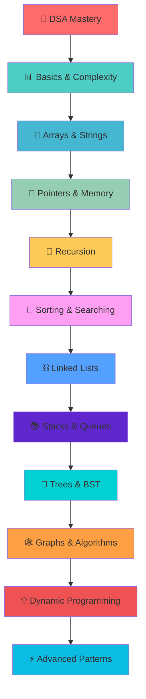

<h1 align="center">
  🚀 My DSA Journey in C++
</h1>

<p align="center">
  <b>💡 Learning Data Structures & Algorithms deeply — not just to memorize, but to <i>understand</i>, <i>implement</i>, and <i>internalize</i></b>
</p>

<div align="center">

  
  
  
  

</div>

---

## 🌟 Learning Resources

<div align="center">

|    | Resource                          | Description                      | Link                                                                                                                                                                                   |
| -- | --------------------------------- | -------------------------------- | -------------------------------------------------------------------------------------------------------------------------------------------------------------------------------------- |
| 📺 | **Complete C++ DSA Course** | Apna College / Shradha Khapra    | [](https://www.youtube.com/playlist?list=PLfqMhTWNBTe137I_EPQd34TsgV6IO55pt) |
| 🎓 | **MIT OCW – 6.006**        | Introduction to Algorithms       | [](https://ocw.mit.edu/courses/6-006-introduction-to-algorithms-spring-2020/)    |
| 📚 | **CLRS Textbook**           | Cormen, Leiserson, Rivest, Stein | *Introduction to Algorithms*                                                                                                                                                         |


</div>

---

## 📖 About This Repository

<div align="center">

|    | Activity                      | Description                         |
| -- | ----------------------------- | ----------------------------------- |
| 🔧 | **Code Implementation** | Well-commented C++ solutions        |
| 📝 | **Notes & Summaries**   | Concepts explained in my own words  |
| 🎯 | **Problem Solving**     | Practice with detailed observations |
| 📊 | **Progress Tracking**   | Visual learning journey             |

</div>

---

## 🗺️ Learning Roadmap



DSA-in-CPP/
│
├── 🏁 01_Basics/
│   ├── 📄 README.md
│   ├── 🔧 loops_patterns.cpp
│   ├── ⚡ time_complexity.cpp
│   └── 📝 concepts_notes.md
│
├── 🔢 02_Arrays/
│   ├── 📄 README.md
│   ├── 🎯 array_operations.cpp
│   ├── 💡 two_pointers.cpp
│   └── 📝 array_notes.md
│
├── 📝 03_Strings/
├── 🔄 04_Recursion/
├── 🎯 05_SearchingSorting/
├── ⛓️ 06_LinkedList/
├── 📚 07_StackQueue/
├── 🌳 08_Tree/
├── 🕸️ 09_Graphs/
├── 💡 10_DP/
└── 📄 README.md

<<<<<<< HEAD
Each folder will contain:

- A `README.md` or summary file
- `.cpp` files of solutions
- Notes or insights
  =======

>>>>>>> 126a18f (Binary Number system)
>>>>>>>
>>>>>>
>>>>>
>>>>
>>>
>>

---

## 📊 Progress Tracker

<div align="center">

| Status | Topic                           | Completion | Notes                             |
| ------ | ------------------------------- | ---------- | --------------------------------- |
| ✅     | **Basics & Fundamentals** | Oct 2025   | Strong foundation established     |
| ✅     | **Patterns & Loops**      | Oct 2025   | Problem-solving mindset developed |
| 🔄     | **Arrays & Strings**      | Nov 2025   | Active practice & implementation  |
| ⏳     | **Pointers & Memory**     | Nov 2025   | Upcoming deep dive                |
| ⏳     | **Recursion**             | Dec 2025   | Building recursive thinking       |

</div>**<div align="center">****Overall Progress:**

**

****Overall Progress:**


`<small>`25% Complete | Journey continues... 🚀**`</small>`**

</div>---

---

## 🚀 Quick Start

---

# Clone the repository

git clone https://github.com/Paxto2002/DSA-Study.git

# Navigate to specific topic

cd DSA-in-CPP/02_Arrays/

# Compile and execute

g++ -std=c++17 solution.cpp -o solution
./solution

## 💫 Learning Philosophy

<div align="center">> ### 🎯 "Don't just code—pause, think, and internalize"

</div>**<div align="center">**

**| 🔓 | **Algorithms Unlocked** | Thomas H. Cormen | *Simplified algorithmic concepts* |

**

**| Principle                     | Icon | Description                                |
| ----------------------------- | ---- | ------------------------------------------ |
| **Deep Understanding**  | 🧠   | Focus on the*why* behind algorithms      |
| **Visual Learning**     | 👁️ | Draw, visualize, and walk through examples |
| **Theory First**        | 📚   | Build strong conceptual foundation         |
| **Consistent Practice** | ⏰   | Little and often beats cramming            |

</div>---

---

---## 🤝 Contribution & Support

<div align="center">Love my journey? Here's how you can support:

[](https://github.com/Paxto2002/DSA-in-CPP)[https://img.shields.io/badge/%E2%AD%90_Give_a_Star-ffd700?style=for-the-badge&amp;logo=stars&amp;logoColor=black](https://img.shields.io/badge/%E2%AD%90_Give_a_Star-ffd700?style=for-the-badge&logo=stars&logoColor=black)
[](https://github.com/Paxto2002/DSA-in-CPP/fork)[https://img.shields.io/badge/%F0%9F%8D%B4_Fork_Repository-00b894?style=for-the-badge&amp;logo=git&amp;logoColor=white](https://img.shields.io/badge/%F0%9F%8D%B4_Fork_Repository-00b894?style=for-the-badge&logo=git&logoColor=white)
[](https://github.com/Paxto2002/DSA-in-CPP/issues)[https://img.shields.io/badge/%F0%9F%90%9B_Report_Issues-ff6b6b?style=for-the-badge&amp;logo=bug&amp;logoColor=white](https://img.shields.io/badge/%F0%9F%90%9B_Report_Issues-ff6b6b?style=for-the-badge&logo=bug&logoColor=white)

</div>---

---

---## 🙏 Acknowledgments

<div align="center">

|        | Contributor              | Role              | Impact                           |
| ------ | ------------------------ | ----------------- | -------------------------------- |
| 👩‍🏫 | **Shradha Khapra** | Instructor        | Clear, engaging C++ DSA lectures |
| 🏛️   | **MIT OCW 6.006**  | Academic Resource | Deep theoretical understanding   |
| 📖     | **CLRS Authors**   | Textbook          | Algorithmic thinking foundation  |

| 🔓 | **Algorithms Unlocked** | Thomas H. Cormen | *Simplified algorithmic concepts* |

`</div>`---

---

---

<div align="center">## 🌈 Let's Connect!

[](https://www.linkedin.com/in/hafiz-waseem-ahmed-50a4b2347/)[https://img.shields.io/badge/LinkedIn-0A66C2?style=for-the-badge&amp;logo=linkedin&amp;logoColor=white](https://img.shields.io/badge/LinkedIn-0A66C2?style=for-the-badge&logo=linkedin&logoColor=white)
[](https://github.com/Paxto2002)[https://img.shields.io/badge/GitHub-181717?style=for-the-badge&amp;logo=github&amp;logoColor=white](https://img.shields.io/badge/GitHub-181717?style=for-the-badge&logo=github&logoColor=white)
[]()[https://img.shields.io/badge/Portfolio-FF6B6B?style=for-the-badge&amp;logo=google-chrome&amp;logoColor=white](https://img.shields.io/badge/Portfolio-FF6B6B?style=for-the-badge&logo=google-chrome&logoColor=white)

> *"The beautiful thing about learning is that no one can take it away from you."* - B.B. King

**Built with 💙 and lots of ☕ by Hafiz Waseem Ahmed**

[https://capsule-render.vercel.app/api?type=waving&amp;color=gradient&amp;height=100&amp;section=footer](https://capsule-render.vercel.app/api?type=waving&color=gradient&height=100&section=footer)

</div> ```

 ```

```

```
